<!-- ALTERNATIVE FOR HTML
  rmarkdown::html_document:
    number_sections: yes
    dev: cairo_pdf
    toc: yes
    toc_depth: 3
    toc_float: true
-->


```{r include=FALSE}
# Store output format for later use
options(vignetteDocumentFormat= rmarkdown::all_output_formats("rodeoFABMVignette.Rmd"))
```


```{r include=FALSE}
library(knitr)
library(readODS)
library(rodeoFABM)
library(xtable)
opts_chunk$set(dpi=300)
options(xtable.caption.placement = 'top',
        xtable.include.rownames = FALSE,
        xtable.comment = FALSE,
        xtable.booktabs = TRUE
  )
```

# Main features of `rodeoFABM`

The `R` package `rodeoFABM` is a colletion of functions to help create water quality models that can
be coupled to physical host models using the `FABM` interface (@bruggeman_general_2014). As the
name suggests it is heaviely influenced by the `R` package [`rodeo`](https://github.com/dkneis/rodeo)
(@kneis_r_package_2017). The principle idea is to creat tools that:

- Decouple the "code writing" from the "model developement" part of creating a model
- Make model adaptation, communikation, and maintenace easier

The main concept is writing the model equations in the standard
[Peterson matrix notation](http://en.wikipedia.org/wiki/Petersen_matrix) and storing them in text files or
spread sheets. The package `rodeoFABM` then can be used to automatically generate `FABM` specific FORTRAN code
from these files, create `.yaml` control files for the water quality model, automatically
compile the 1D physical lake model `GOTM` (@burchard_2006) coupled with the model, and generate \LaTeX{} documentation of the model.

# Installation and requirements

So far `rodeoFABM` was only tested with different Linux based operating systems. In order to use `rodeoFABM` and run the examples some software tools are neede:

- The GNU compilers ([gcc.gnu.org]{https://gcc.gnu.org})
- GNU Make ([gnu.org/software/make/]{https://gnu.org/software/make/})
- GNU CMake ([cmake.org]{https://cmake.org})
- R and devtools ([R-project.org](https://r-project.org))
- git ([git-scm.com](https://git-scm.com))
- the netcdf libraries
- R packages: `readODS`, `plot3D`, `ncdf4`, `reshape2`, and `RColorBrewer`

The package `rodeoFABM` can be installed from github using:

```{r eval=FALSE}
library("devtools")
install_github("JFeldbauer/rodeoFABM")
```


# Basic use


## First example {#first_exmpl}

To demonstrate the workflow we will create and compile a simple model. The files used in this example
are contained in the package and can be copied to the current working directory using:

```{r results="hide", warning=FALSE, eval=FALSE}
# copy example ods file
example_model <- system.file("extdata/simple_model.ods", package = "rodeoFABM")
file.copy(from = example_model, to = ".", recursive = TRUE)
```

This will copy the Libre Office spread sheet *simple_model.ods* to your current working directory.
Now we can read in the tables with the declarations of state variables, model parameters, used
functions and external dependencies, process rate descriptions, and stoichiometry matrix.

```{r  message=FALSE, warning=FALSE, results="hide", eval=FALSE}
library(readODS)

# read in example ods file
odf_file <- "simple_model.ods"
vars <- read_ods(odf_file, sheet = 1)
pars <- read_ods(odf_file, sheet = 2)
funs <- read_ods(odf_file, sheet = 3)
pros <- read_ods(odf_file, sheet = 4)
stoi <- read_ods(odf_file, sheet = 5)

```

We store the declarations in the five data frames *vars*, *pars*, *funs*, *pros*, and *stoi*. Using
these we can now generate FORTRAN source files using the function `gen_fabm_code()`

```{r eval=FALSE}
library(rodeoFABM)

# generate fabm code
gen_fabm_code(vars,pars,funs,pros,stoi,"simple_model.f90",diags = TRUE)
```

This will create two new files: the *FABM* specific FORTRAN source code *simple_model.f90* and the
control file *fabm.yaml* which can be used to change model parameters and initial conditions.
The function also checks if all parameter, functions, and state variables used are also decalred and
issues a warning because the units decalred for the parameters are not in seconds, which is required
by *FABM*.

Using the source code file *simple_model.f90* we can compile *GOTM-FABM*. Therfore we first need to
clone the lake branche of *GOTM* from github and prepare the build process. This can automatically
be done using the function `clone_GOTM()`:

```{r  message=FALSE, warning=FALSE, results="hide", eval=FALSE}
# clone github repo
clone_GOTM(build_dir = "build", src_dir = "gotm_src")
```

This will take a moment and download the source code for *GOTM* and *FABM* as well as prepare the
compilation using *CMake*. You can see that there are now two new folders in the working directory
called *gotm_src* and *build*. Now we can build *GOTM-FABM* with our simple model using the
*simple_model.f90* file and the `build_gotm()` function:

```{r  message=FALSE, warning=FALSE, results="hide", eval=FALSE}
# build GOTM
build_GOTM(build_dir = "build",fabm_file = "simple_model.f90",
           src_dir = "gotm_src")
```

This will copy the *simple_model.f90* file we just created to the correct folder within the
*gotm_src* folder and then compile *GOMT-FABM* using *make*. As a last step it will copy the
created executable to the current working directory. You can see that there is now a *gotm*
executable file in the working directory. In order to run our created model we will need a
*gotm.yaml* file (the GOTM controll fille), an hypsograph file, and the meteorological forcing data.
We will copy the example files provides in this package by using: 

```{r  message=FALSE, warning=FALSE, results="hide", eval=FALSE}
# copy example gotm.yaml
yaml <- system.file("extdata/gotm.yaml", package = "rodeoFABM")
file.copy(from = yaml, to = ".", recursive = TRUE)
# write hypsograph
write.table(hypsograph, "hypsograph.dat", sep = "\t", row.names = FALSE,
            quote = FALSE)
# write meteo data
write.table(meteo_file, "meteo_file.dat", sep = "\t", row.names = FALSE,
            quote = FALSE)
```

Now that we have the files *gotm.yaml*, *hypsograph.dat*, and *meteo_file.dat* in our working
directory, we can run *GOTM-FABM* using:

```{r  message=FALSE, warning=FALSE, results="hide", eval=FALSE}
# run gotm
system2("./gotm")
```

After successfully running there are two new files: *output.nc* and *restart.nc*, both are netcdf
files. *output.nc* is the output of the model run and *restart.nc* is a netcdf file that can be used
to initialize a simulation with states stored from the previous run. We can plot the results e.g. by
using the `plot_var()` function:

```{r message=FALSE, warning=FALSE, results="hide", eval=FALSE}
# plot temperature
plot_var("output.nc", "temp")

# plot oxygen
plot_var("output.nc", "rodeo_C_O2")

```

```{r echo=FALSE, out.width='100%'}
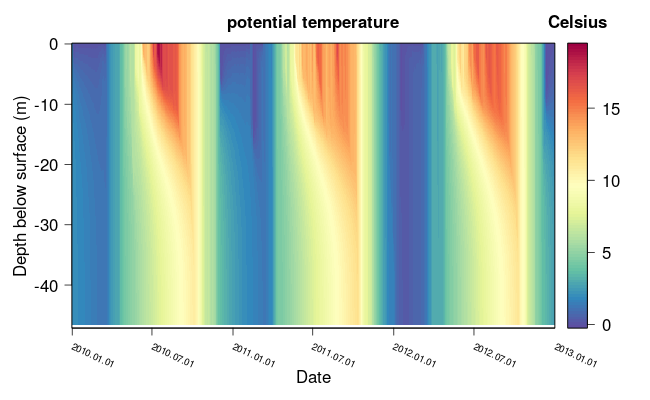
```

```{r echo=FALSE, out.width='100%'}
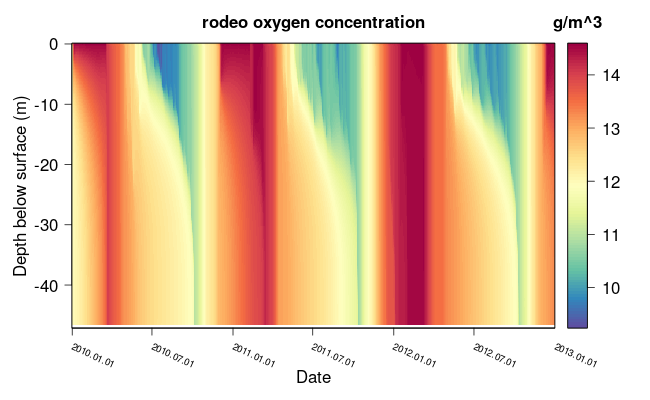
```


These are the essential steps used to build and run a *GOTM-FABM* model. In the next section we will
go a little bit more into the details of building a own model using the `rodeoFABM` package and
explain them step by step.

## Create a model step by step

In order to demonstrate the necessary steps and functionalities we will create a simple
phytoplankton-nutrients model and progressively add more processes and state variables.

All used Libre Office spread sheets containing the model information, the GOTM controll file, and
the forcing data are contained in the `rodeoFABM` package. You can copy all necessary files to run
GOTM using the same method as described [in the first example](#first_exmpl). We will use the same
meteorological forcing (*meteo_file.dat*) and hypsographic curve (*hypsograph.dat*) as in the
[first example](#first_exmpl). Additionally we now add one inflow and one outflow 
(files `inflow_m.dat`, `outflow.dat`, and `inflow_wq_m.dat` containing the nutrient concentrations
of the inflow)

```{r message=FALSE, warning=FALSE, results="hide", eval=FALSE}
## copy necessary files

# GOTM controll fille
yaml <- system.file("extdata/examples/gotm.yaml",
                   package = "rodeoFABM")
file.copy(from = yaml, to = ".", recursive = TRUE)
# inflow hydrological data
infl <- system.file("extdata/examples/inflow_m.dat",
                   package = "rodeoFABM")
file.copy(from = infl, to = ".", recursive = TRUE)
# inflow nutient data
nut <- system.file("extdata/examples/inflow_wq_m.dat",
                   package = "rodeoFABM")
file.copy(from = nut, to = ".", recursive = TRUE)
# outflow data
out <- system.file("extdata/examples/outflow.dat",
                   package = "rodeoFABM")
file.copy(from = out, to = ".", recursive = TRUE)
```


The inflows and especially the inflow of state variables to a *FABM* model are defined in the
`streams` section of the *GOTM* control file (*gotm.yaml*). The section looks like this:

```{yaml}
streams:
   inflow:                                    # stream configuration
      method: 4                                 # inflow method, default=1
      zu: 0.0                                   # upper limit m
      zl: 0.0                                   # lower limit m
      flow:                                     # water flow
         method: 2                              # 0=constant, 2=from file, default = 0
         constant_value: 1.0                    # constant value( m^3/s)
         file: inflow_m.dat                     # path to file with time series 
         column: 1                              # index of column to read from 
      temp:                                     # flow temperature
         method: 2                              # 0=constant, 2=from file; default=0
         constant_value: 10.0                   # constant value (°C)
         file: inflow_m.dat                     # path to file with time series 
         column: 2                              # index of column to read from 
      salt:                                     # flow salinity
         method: 0                              # 0=constant, 2=from file; default=0
         constant_value: -1.0                   # constant value (PSU)
         file: inflow.dat                       # path to file with time series 
         column: 3                              # index of column to read from
      rodeo_HPO4:                               # rodeo phosphprus
         method: 0                              # 0=constant, 2=from file; default=0
         constant_value: 0.5                    # constant value (gP/m^3)
         file: inflow_wq_m.dat                  # path to file with time series
         column: 4                              # index of column to read from
```

Within the `streams` section several in- and outflows can be defined with any desired name (here
"inflow"). The inflow/outflow depth is defined by `streams/method`, whereas `1` means surface, `2`
means bottom, `3` means a specified range of depths defined by `streams/zu` (upper) and `streams/zl`
(l), and `4` means inflow to the depth with same temperature as the inflow temperature. Every in- or
outflow needs the `streams/flow` section defining the flow rate in m$^3$/s and can have additional
entries like `streams/temp` for temperature or inflowing state variables of the *FABM* model (like
`streams/rodeo_HPO4`). The *FABM* sate variables need to start with *rodeo_* followd by the defined
state variable name. The values can either be constant (`streams/rodeo_HPO4/method` = 0) or a time
series given by a tab separated file (`streams/rodeo_HPO4/method` = 2) with first column datetime
(as `YYYY-mm-dd HH:MM:ss`). The name of the file is supplied by `streams/rodeo_HPO4/file` and the
column the variable is in by `streams/rodeo_HPO4/column`, take care: the first column with datetime
is not counted and if the columns have a header it needs to start with an excalamation mark "!".

We can create the source code of the phytoplankton nutients model in the same way as we created
the source code in the [first example](#first_exmp):

```{r message=FALSE, warning=FALSE, results="hide"}
# copy the spread sheet
ods <- system.file("extdata/examples/simple_alg.ods",
                   package = "rodeoFABM")
file.copy(from = ods, to = ".", recursive = TRUE)

# declare data frames for vars, pars, funs, pros, and stoi
vars <- read_ods("simple_alg.ods", sheet = "vars")
pars <- read_ods("simple_alg.ods", sheet = "pars")
funs <- NULL
pros <- read_ods("simple_alg.ods", sheet = "pros")
stoi <- read_ods("simple_alg.ods", sheet = "stoi")
```

This first model is a simple model with two state variables, which are declared in the `vars`
data frame. The table needs to have at least three columns: *name* giving the identifier of the state
variable, *unit* giving the used unit, and *description* giving a short description of the state
variable. If additionally the column *default* is supplied the initial value will be included in the
*FABM* control file (`fabm.yaml`), which is automatically generated by `gen_fabm_code()`.

```{r, echo=FALSE}
library(rodeo)
vars_t <- vars
vars_t$name <- paste0("$",vars_t$name, "$")
vars_t$name <- gsub("_", "\\_", vars_t$name, fixed = TRUE)
kable(vars_t, caption="Data frame `vars`: Declaration of state variables.")
```


The models parameters are defined in the `pars` data frame in a similar fashion. They need the same
three columns *name*, *unit*, and *description* and can have the aditional column *default* as well.
Take care that *FABM* requires all parameters with relation to time to be in units of second.


```{r, echo=FALSE}
library(rodeo)
pars_t <- pars
pars_t$name <- paste0("$",pars_t$name, "$")
pars_t$name <- gsub("_", "\\_", pars_t$name, fixed = TRUE)
kable(pars_t, caption="Data frame `pars`: Declaration of model parameters.")
```

External functions, or forcing data that needs to be obtained from the physical host model (e.g.
water temperature) are defined in `funs`. As this first model has no such functions or dependencies
this is explaine in the later steps. As in this example the data frame is not needed it hast to be
set to `NULL`.

The declaration of the processes and process rates is done in the `pros` data frame. It has four
requred columns: *name* giving the name of the proicess, *unit* giving the unit of the process rate
(again in seconds), *description* giving a short description of the process, and *expression*
giving the mathematical expression of the process. There can be additional columns to define the
saptial domain of the process, or to declare sinking processes and they will be explained later.

```{r, echo=FALSE}
library(rodeo)
pros_t <- pros
pros_t$expression <- gsub("*", " \\cdot ", pros_t$expression, fixed = TRUE)
pros_t$expression <- gsub("+", " + ", pros_t$expression, fixed = TRUE)
pros_t$expression <- gsub("-", " - ", pros_t$expression, fixed = TRUE)
pros_t$expression <- gsub("/", " / ", pros_t$expression, fixed = TRUE)
pros_t$expression <- gsub("_", "\\_", pros_t$expression, fixed = TRUE)
pros_t$expression <- paste0("$",pros_t$expression, "$")
kable(pros_t, caption="Data frame `pros`: Declaration of processes.")
```

In this model the phytoplankton have a simple linear growth term with a Monod like limitation for
the limiting nutrient Phosphorus and a linear decay/death term.

The last data frame `stoi` gives the stoichiometry table (in long format) connecting the process
rates with the state variables. It has three required columns: *variable* giving the variable
affected by the *process*, and *expression* giving a factor to multiply the process rate by:

```{r, echo=FALSE}
library(rodeo)
stoi_t <- stoi
stoi_t$expression <- gsub("*", " \\cdot ", stoi_t$expression, fixed = TRUE)
stoi_t$expression <- gsub("+", " + ", stoi_t$expression, fixed = TRUE)
stoi_t$expression <- gsub("/", " / ", stoi_t$expression, fixed = TRUE)
stoi_t$expression <- gsub("_", "\\_", stoi_t$expression, fixed = TRUE)
stoi_t$expression <- paste0("$",stoi_t$expression, "$")
stoi_t$variable <- paste0("$",stoi_t$variable, "$")
stoi_t$variable <- gsub("_", "\\_", stoi_t$variable, fixed = TRUE)
kable(stoi_t, caption="Data frame `stoi`: Declaration of stoichiometry matrix in long format.")
```


The growth of phytoplankton is increasing its concentration $C$ and decreasing the nutrient $HPO4$
by the fraction of $a_P$, which is the Phosphorus conten of the phytoplankton. Decay/death is
decreasing phytoplankton concentration $C$.

Having declared all five data frames we can now generate the fortran code using `gen_fabm_code()`.
This will also perfome some automated checks e.g. if all used parameters and state variables are
also declared, and will issue a warning if the used units are not using seconds for time. It will
also create the *FABM* control file `fabm.yaml` and insert the default values for parameters and
initial values (if declared). If the argument `diags` is set to TRUE the process rates are stored as
diagnostic variables in the output netcdf file. 

```{r message=FALSE, warning=FALSE, results="hide", eval=FALSE}
# create the fabm code
gen_fabm_code(vars, pars, funs, pros, stoi, "model_1.f90", diags = TRUE)
```

After creating the fortran source code, *GOTM-FABM* can be automatically compiled unsing the
function `build_GOTM()` (assuming the source code was allready fetched and prepared for compilation
using `clone_GOTM()`), this will also copy the compiled executable to the current working directory,
which then can be ran using e.g. `system2("./gotm")`. 

```{r message=FALSE, warning=FALSE, results="hide", eval=FALSE}
# build GOTM with the model
build_GOTM(build_dir = "build", src_dir = "gotm_src",
           fabm_file = "model_1.f90")

# run the model
system2("./gotm")
```

We can now plot the model results e.g. using the `plot_var()` function:

```{r  message=FALSE, warning=FALSE, results="hide", eval=FALSE}
# plot the variables
plot_var("output.nc", "rodeo_C")
plot_var("output.nc", "rodeo_HPO4")
```

```{r echo=FALSE, out.width='100%'}
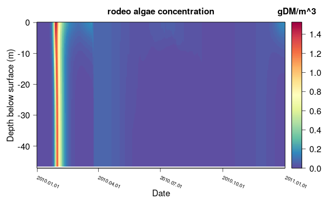
```

```{r echo=FALSE, out.width='100%'}
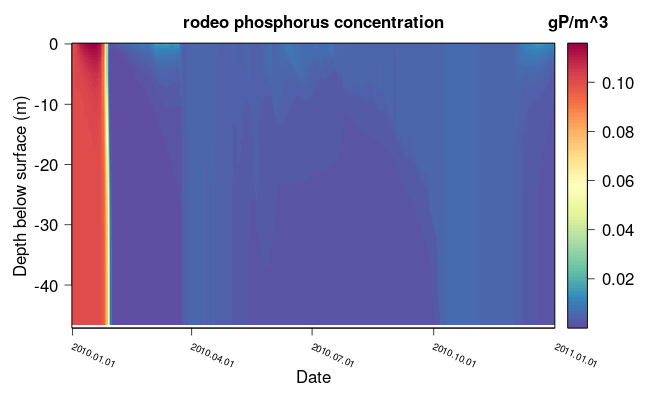
```

### Getting dependencies from the host model

As many biogeochemical processes depend on external forcing, such as temperature or available
iradiation, these values can be obtained from the physical host model. In the next step we want to
add the dependency of phytoplankton growth on available iradiation. We first copy the prepared
spread sheet and declare the data frames:

```{r message=FALSE, warning=FALSE, results="hide"}
ods <- system.file("extdata/examples/simple_alg_par.ods",
                   package = "rodeoFABM")
file.copy(from = ods, to = ".", recursive = TRUE)

# declare data frames for vars, pars, funs, pros, and stoi
vars <- read_ods("simple_alg_par.ods", sheet = "vars")
pars <- read_ods("simple_alg_par.ods", sheet = "pars")
funs <- read_ods("simple_alg_par.ods", sheet = "funs")
pros <- read_ods("simple_alg_par.ods", sheet = "pros")
stoi <- read_ods("simple_alg_par.ods", sheet = "stoi")
```

We need to get values for the photosynthetic active radiation (PAR) from GOTM. *FABM* has so
called "standard-variables" with defined names (stored in the `std_names_FABM` data). If you want to
access these variables you need to defind them as a function in the `funs` data frame and add the
additional column *dependency* wich contains the full standard-variable name. The data frame `funs`
has three required columns that are the same as in `vars`, and `pars`: *name*, *unit*, and
*description*, additionally the column *dependency*. If you declare several functions of whome some
are not dependencies the corresponding entry in column *dependency* needs to be empty (`NA`) for these and
the corresponding standard-name for the ones that are dependencies.

```{r, echo=FALSE}
library(rodeo)
funs_t <- funs
funs_t$name <- paste0("$",funs_t$name, "$")
funs_t$name <- gsub("_", "\\_", funs_t$name, fixed = TRUE)
kable(funs_t, caption = paste0("Data frame `funs`: Declaration of model functions and dependencies ",
                               "from the host model."))
```

The declared functions/dependencies can now be used in the process expression, same as parameters
and state variables. We added a Monod Term for light limitation in the *growth* process:

```{r, echo=FALSE}
library(rodeo)
pros_t <- pros
pros_t$expression <- gsub("*", " \\cdot ", pros_t$expression, fixed = TRUE)
pros_t$expression <- gsub("+", " + ", pros_t$expression, fixed = TRUE)
pros_t$expression <- gsub("-", " - ", pros_t$expression, fixed = TRUE)
pros_t$expression <- gsub("/", " / ", pros_t$expression, fixed = TRUE)
pros_t$expression <- gsub("_", "\\_", pros_t$expression, fixed = TRUE)
pros_t$expression <- paste0("$",pros_t$expression, "$")
kable(pros_t, caption="Data frame `pros`: Declaration of processes.")
```

For this we need to declare the additional parameter $K\_par$ for the half-saturation irradiation in the
`pars` data frame:

```{r, echo=FALSE}
library(rodeo)
pars_t <- pars
pars_t$name <- paste0("$",pars_t$name, "$")
pars_t$name <- gsub("_", "\\_", pars_t$name, fixed = TRUE)
kable(pars_t, caption="Data frame `pars`: Declaration of model parameters.")
```

Now we can generate the fortran code, compile *GOTM-FABM*, and run the adapted model.

```{r message=FALSE, warning=FALSE, results="hide", eval=FALSE}
# create the fabm code
gen_fabm_code(vars, pars, funs, pros, stoi, "model_2.f90", diags = TRUE)

# build GOTM with the model
build_GOTM(build_dir = "build", src_dir = "gotm_src",
           fabm_file = "model_2.f90")

# run the model
system2("./gotm")
```

And plot some of the simulated state variables:

```{r message=FALSE, warning=FALSE, results="hide", eval=FALSE}
# plot the variables
plot_var("output.nc", "rodeo_C")
plot_var("output.nc", "rodeo_HPO4")
```

```{r echo=FALSE, out.width='100%'}
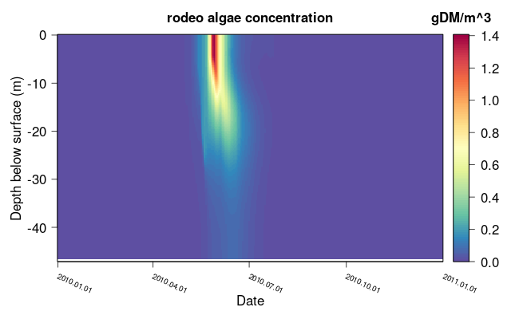
```

```{r echo=FALSE, out.width='100%'}
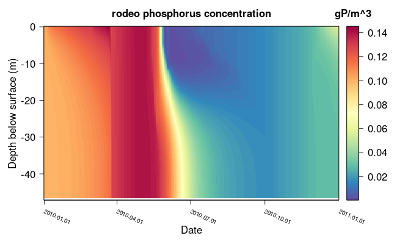
```

From the saved process rates (the diagnostic variables) we can e.g. plot the net growth rate. We
can acces the values stored in the netcdf file e.g. by using the function `get_var()` and
plot them using `plot3D::image2D()`:

```{r message=FALSE, warning=FALSE, results="hide", eval=FALSE}
library(plot3D)

# also plot net. growth
growth <- get_var("output.nc", "rodeo_growth")
death <- get_var("output.nc", "rodeo_death")
net_growth <- growth$var - death$var
# nice colors
mycol <- colorRampPalette(rev(RColorBrewer::brewer.pal(11, 'Spectral')))
# plot the net. growth
image2D(net_growth, growth$time, growth$z, main = "net. growth", col = mycol(100), xaxt = "n",
        xlab = "Date", ylab = "Depth below surface (m)")
axis(1, at = pretty(growth$time), labels = FALSE)
text(pretty(growth$time), par("usr")[3] - 3, labels = format(pretty(growth$time), "%Y.%m.%d"),
     xpd = NA, srt = 336, adj = 0.0, cex = 0.8)
```

```{r echo=FALSE, out.width='100%'}
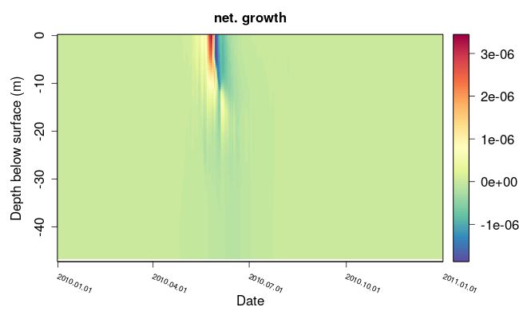
```

### Sedimentation

Often in biogeochemical models some state variables are sinking in the water body (e.g.
phytoplankton or particulated organic matter). In the next adaptation of the model we want to include
a constant sinking velocity for the phytoplankton. Therefore, we again copy the spread sheets
from the package data in order to declare the data frames:

```{r message=FALSE, warning=FALSE, results="hide"}
ods <- system.file("extdata/examples/simple_alg_par_sed.ods",
                   package = "rodeoFABM")
file.copy(from = ods, to = ".", recursive = TRUE)

# declare data frames for vars, pars, funs, pros, and stoi
vars <- read_ods("simple_alg_par_sed.ods", sheet = "vars")
pars <- read_ods("simple_alg_par_sed.ods", sheet = "pars")
funs <- read_ods("simple_alg_par_sed.ods", sheet = "funs")
pros <- read_ods("simple_alg_par_sed.ods", sheet = "pros")
stoi <- read_ods("simple_alg_par_sed.ods", sheet = "stoi")
```

*FABM* allows for time varying sinking of state variables. This in implemented in *rodeoFABM* as a
process declared in the `pros` data frame that has a logical flag set in an additional column called
*sedi*. The expression for this can also be a function of external dependencies (e.g. water density)
or internal state variables (e.g. nutrient concentration), in this simple case we choose a constant
sinking velocity:

```{r, echo=FALSE}
library(rodeo)
pros_t <- pros
pros_t$expression <- gsub("*", " \\cdot ", pros_t$expression, fixed = TRUE)
pros_t$expression <- gsub("+", " + ", pros_t$expression, fixed = TRUE)
pros_t$expression <- gsub("-", " - ", pros_t$expression, fixed = TRUE)
pros_t$expression <- gsub("/", " / ", pros_t$expression, fixed = TRUE)
pros_t$expression <- gsub("_", "\\_", pros_t$expression, fixed = TRUE)
pros_t$expression <- paste0("$",pros_t$expression, "$")
kable(pros_t, caption="Data frame `pros`: Declaration of processes.")
```

For this to work we need to declare the additional parameter for the sinking velocity:

```{r, echo=FALSE}
library(rodeo)
pars_t <- pars
pars_t$name <- paste0("$",pars_t$name, "$")
pars_t$name <- gsub("_", "\\_", pars_t$name, fixed = TRUE)
kable(pars_t, caption="Data frame `pars`: Declaration of model parameters.")
```


And add the process to the stopichiometry table:

```{r, echo=FALSE}
library(rodeo)
stoi_t <- stoi
stoi_t$expression <- gsub("*", " \\cdot ", stoi_t$expression, fixed = TRUE)
stoi_t$expression <- gsub("+", " + ", stoi_t$expression, fixed = TRUE)
stoi_t$expression <- gsub("/", " / ", stoi_t$expression, fixed = TRUE)
stoi_t$expression <- gsub("_", "\\_", stoi_t$expression, fixed = TRUE)
stoi_t$expression <- paste0("$",stoi_t$expression, "$")
stoi_t$variable <- paste0("$",stoi_t$variable, "$")
stoi_t$variable <- gsub("_", "\\_", stoi_t$variable, fixed = TRUE)
kable(stoi_t, caption="Data frame `stoi`: Declaration of stoichiometry matrix in long format.")
```

Now we can create the FORTRAN source code file, compile *GOTM-FABM*, run the model, and plot some of the
results:

```{r message=FALSE, warning=FALSE, results="hide", eval=FALSE}
# create the fabm code
gen_fabm_code(vars, pars, funs, pros, stoi, "model_3.f90")

# build GOTM with the model
build_GOTM(build_dir = "build", src_dir = "gotm_src",
           fabm_file = "model_3.f90")

# run the model
system2("./gotm")

# plot the variables
plot_var("output.nc", "rodeo_C")
plot_var("output.nc", "rodeo_HPO4")

# also plot net. growth
growth <- get_var("output.nc", "rodeo_growth")
death <- get_var("output.nc", "rodeo_death")
net_growth <- growth$var - death$var

image2D(net_growth, growth$time, growth$z, main = "net. growth", col = mycol(100), xaxt = "n",
        xlab = "Date", ylab = "Depth below surface (m)")
axis(1, at = pretty(growth$time), labels = FALSE)
text(pretty(growth$time), par("usr")[3] - 3, labels = format(pretty(growth$time), "%Y.%m.%d"),
     xpd = NA, srt = 336, adj = 0.0, cex = 0.8)
```

```{r echo=FALSE, out.width='100%'}
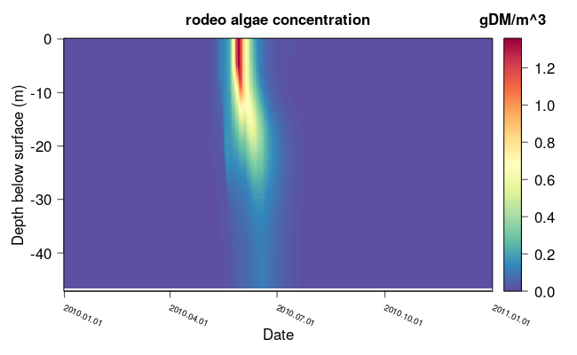
```

```{r echo=FALSE, out.width='100%'}
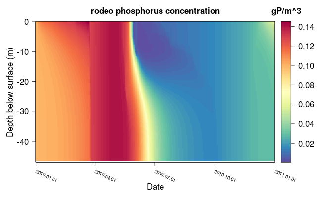
```

```{r echo=FALSE, out.width='100%'}
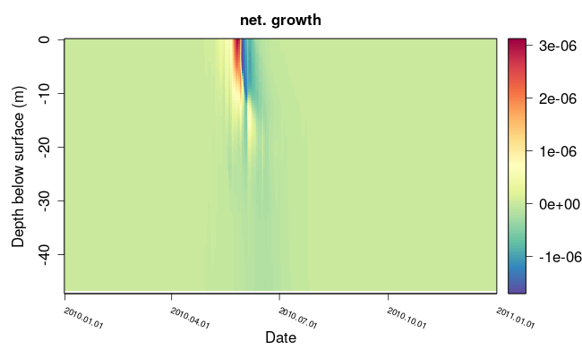
```

### Processes at the surface and sediment

There are some processes that only take place at the surface or bottom (sediment) of lakes. *FABM*
knows three spatial domains: open water (pelagial), surface, and bottom (sediment) and processes can
be declared to only take place at one of these domaines. To demonstrate this we add the new state
variable Oxygen along with the processes of surface exchange and a constant oxygen consumption in
the sediment to the model. We again start by copying the spread sheet from the package data:

```{r message=FALSE, warning=FALSE, results="hide"}
ods <- system.file("extdata/examples/simple_alg_O2.ods",
                   package = "rodeoFABM")
file.copy(from = ods, to = ".", recursive = TRUE)
# read in first simple model
vars <- read_ods("simple_alg_O2.ods", sheet = "vars")
pars <- read_ods("simple_alg_O2.ods", sheet = "pars")
funs <- read_ods("simple_alg_O2.ods", sheet = "funs")
pros <- read_ods("simple_alg_O2.ods", sheet = "pros")
stoi <- read_ods("simple_alg_O2.ods", sheet = "stoi")
```

Here we added the new state variable $O2$ to the `vars` data frame:

```{r, echo=FALSE}
library(rodeo)
vars_t <- vars
vars_t$name <- paste0("$",vars_t$name, "$")
vars_t$name <- gsub("_", "\\_", vars_t$name, fixed = TRUE)
kable(vars_t, caption="Data frame `vars`: Declaration of state variables.")
```


If processes occure only at the surface or bottom interface we can declare this by setting a logical
flag in additional columns in the `pros` data frame called *bot* and *surf*. We have two new
processes *O2_exch*, and *O2_cons* and the flags in the corresponding columns are set to TRUE:

```{r echo=FALSE}
pros_t <- pros
pros_t$expression <- gsub("*", " \\cdot ", pros_t$expression, fixed = TRUE)
pros_t$expression <- gsub("+", " + ", pros_t$expression, fixed = TRUE)
pros_t$expression <- gsub("-", " - ", pros_t$expression, fixed = TRUE)
pros_t$expression <- gsub("/", " / ", pros_t$expression, fixed = TRUE)
pros_t$expression <- gsub("_", "\\_", pros_t$expression, fixed = TRUE)
pros_t$name <- gsub("_", "\\_", pros_t$name, fixed = TRUE)
pros_t$unit <- gsub("^", "\\^{}", pros_t$unit, fixed = TRUE)

pros_t$expression <- paste0("$",pros_t$expression, "$")
```
```{r echo=FALSE, results = "asis"}
print(xtable(pros_t, caption="Data frame `pros`: Declaration of processes."),
      size="\\fontsize{4.5pt}{5pt}\\selectfont", type = "latex",table.placement = "!h",
      sanitize.text.function=function(x){x})
```

We declared the additional parameters for the oxygen exchange velocity, the constant
consumption in the sediment, and the half-saturation concentration of oxygen limiting the oxygen
consumption in the sediment:

```{r, echo=FALSE}
library(rodeo)
pars_t <- pars
pars_t$name <- paste0("$",pars_t$name, "$")
pars_t$name <- gsub("_", "\\_", pars_t$name, fixed = TRUE)
kable(pars_t, caption="Data frame `pars`: Declaration of model parameters.")
```

We also declared the used functions $log$, and $exp$, as well as the external dependencies $p$
(the barometric pressure at the surface), and $Temp$ (water temperature) which are needed to
calculate the oxygen saturation concentration:

```{r, echo=FALSE}
library(rodeo)
funs_t <- funs
funs_t$name <- paste0("$",funs_t$name, "$")
funs_t$name <- gsub("_", "\\_", funs_t$name, fixed = TRUE)
kable(funs_t, caption = paste0("Data frame `funs`: Declaration of model functions and dependencies ",
                               "from the host model."))
```

And added the new processes to the stoichiometry table:

```{r, echo=FALSE}
library(rodeo)
stoi_t <- stoi
stoi_t$expression <- gsub("*", " \\cdot ", stoi_t$expression, fixed = TRUE)
stoi_t$expression <- gsub("+", " + ", stoi_t$expression, fixed = TRUE)
stoi_t$expression <- gsub("/", " / ", stoi_t$expression, fixed = TRUE)
stoi_t$expression <- gsub("_", "\\_", stoi_t$expression, fixed = TRUE)
stoi_t$expression <- paste0("$",stoi_t$expression, "$")
stoi_t$variable <- paste0("$",stoi_t$variable, "$")
stoi_t$variable <- gsub("_", "\\_", stoi_t$variable, fixed = TRUE)
kable(stoi_t, caption="Data frame `stoi`: Declaration of stoichiometry matrix in long format.")
```

We can generate the source code, compile *GOTM-FABM*, run the model, and plot some of the results
using:

```{r message=FALSE, warning=FALSE, results="hide", eval=FALSE}
# create the fabm code
gen_fabm_code(vars, pars, funs, pros, stoi, "model_4.f90")

# build GOTM with the model
build_GOTM(build_dir = "build", src_dir = "gotm_src",
           fabm_file = "model_4.f90")

# run the model
system2("./gotm")

# plot the variables
plot_var("output.nc", "rodeo_C")
plot_var("output.nc", "rodeo_HPO4")
plot_var("output.nc", "rodeo_O2")
```

```{r echo=FALSE, out.width='100%'}

```

```{r echo=FALSE, out.width='100%'}

```

```{r echo=FALSE, out.width='100%'}
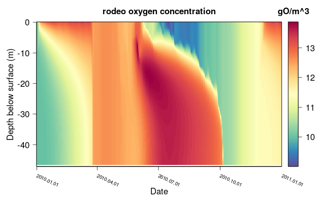
```

### Sediment or surface attached state variables{#final_model}

As mentioned before *FABM* recognizes three spatial domains: open water, surface, and sediment. Like
Processes, state variables can also be attached to one of these domaines (e.g. sedimented
particulated organic matter). To demonstrate this feature we will include two more state variables
in our model; particulated organic matter ($POM$) and sedimented particulated organic matter
($SPOM$). Again we need to copy the spread sheet from the package:

```{r message=FALSE, warning=FALSE, results="hide"}
ods <- system.file("extdata/examples/simple_alg_O2_POM.ods",
                   package = "rodeoFABM")
file.copy(from = ods, to = ".", recursive = TRUE)

# read in first simple model
vars <- read_ods("simple_alg_O2_POM.ods", sheet = "vars")
pars <- read_ods("simple_alg_O2_POM.ods", sheet = "pars")
funs <- read_ods("simple_alg_O2_POM.ods", sheet = "funs")
pros <- read_ods("simple_alg_O2_POM.ods", sheet = "pros")
stoi <- read_ods("simple_alg_O2_POM.ods", sheet = "stoi")
```

We added the two new state variables $POM$ and $SPOM$ and declared $SPOM$ as bottom bound state
variable by adding another column to the `vars` data frame called *bot* and set it to $TRUE$ for all
bottom bound state variables and to $NA$ (empty) or $FALSE$ for all others. Surface bound state
variables can be declared in the same manner using a column named *surf*.

```{r, echo=FALSE}
library(rodeo)

vars_t <- vars[,colnames(vars)!="tex"]
vars_t$name <- paste0("$",vars_t$name, "$")
vars_t$name <- gsub("_", "\\_", vars_t$name, fixed = TRUE)
kable(vars_t, caption="Data frame `vars`: Declaration of state variables.")
```

Looking at the stoichiometry table we can see that the death of algae generates $POM$, which
settles down, and sediments to the ground to become $SPOM$. Both $POM$ and $SPOM$ are mineralized,
releasing $HPO4$ but the mineralization is faster in the sediment (see *pars* table).
We added the new sinking, sedimentation, and mineralization processes to the `pros` data frame:

```{r echo=FALSE}
pros_t <- pros[,colnames(pros)!="tex"]
pros_t$expression <- gsub("*", " \\cdot ", pros_t$expression, fixed = TRUE)
pros_t$expression <- gsub("+", " + ", pros_t$expression, fixed = TRUE)
pros_t$expression <- gsub("-", " - ", pros_t$expression, fixed = TRUE)
pros_t$expression <- gsub("/", " / ", pros_t$expression, fixed = TRUE)
pros_t$expression <- gsub("_", "\\_", pros_t$expression, fixed = TRUE)
pros_t$name <- gsub("_", "\\_", pros_t$name, fixed = TRUE)
pros_t$unit <- gsub("^", "\\^{}", pros_t$unit, fixed = TRUE)

pros_t$expression <- paste0("$",pros_t$expression, "$")
```
```{r echo=FALSE, results = "asis"}
print(xtable(pros_t, caption="Data frame `pros`: Declaration of processes."),
      size = "\\fontsize{4.5pt}{5pt}\\selectfont", type = "latex",table.placement = "!h",
      sanitize.text.function=function(x){x})
```

And we adapted the stoichiometry table:

```{r, echo=FALSE}
library(rodeo)
stoi_t <- stoi
stoi_t$expression <- gsub("*", " \\cdot ", stoi_t$expression, fixed = TRUE)
stoi_t$expression <- gsub("+", " + ", stoi_t$expression, fixed = TRUE)
stoi_t$expression <- gsub("/", " / ", stoi_t$expression, fixed = TRUE)
stoi_t$expression <- gsub("_", "\\_", stoi_t$expression, fixed = TRUE)
stoi_t$expression <- paste0("$",stoi_t$expression, "$")
stoi_t$variable <- paste0("$",stoi_t$variable, "$")
stoi_t$variable <- gsub("_", "\\_", stoi_t$variable, fixed = TRUE)
kable(stoi_t, caption="Data frame `stoi`: Declaration of stoichiometry matrix in long format.")
```

We declared the new parameters for the sinking velocity, the mineralization kinetic, and the
half-saturation concentration limiting the mineralization: 

```{r, echo=FALSE}
library(rodeo)
pars_t <- pars[,colnames(pars)!="tex"]
pars_t$name <- paste0("$",pars_t$name, "$")
pars_t$name <- gsub("_", "\\_", pars_t$name, fixed = TRUE)
kable(pars_t, caption="Data frame `pars`: Declaration of model parameters.")
```


We can create fortran source code, compile *GOTM-FABM*, run the model, and plot the results using:

```{r message=FALSE, warning=FALSE, results="hide", eval=FALSE}
# create the fabm code
gen_fabm_code(vars, pars, funs, pros, stoi, "model_5.f90")

# build GOTM with the model
build_GOTM(build_dir = "build", src_dir = "gotm_src",
           fabm_file = "model_5.f90")

# run the model
system2("./gotm")

# plot the variables
plot_var("output.nc", "rodeo_C")
plot_var("output.nc", "rodeo_HPO4")
plot_var("output.nc", "rodeo_O2")
plot_var("output.nc", "rodeo_POM")
plot_var("output.nc", "rodeo_SPOM")
```

```{r echo=FALSE, out.width='100%'}
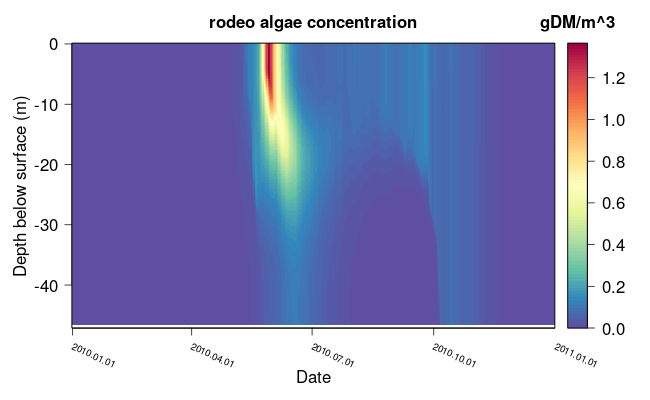
```

```{r echo=FALSE, out.width='100%'}
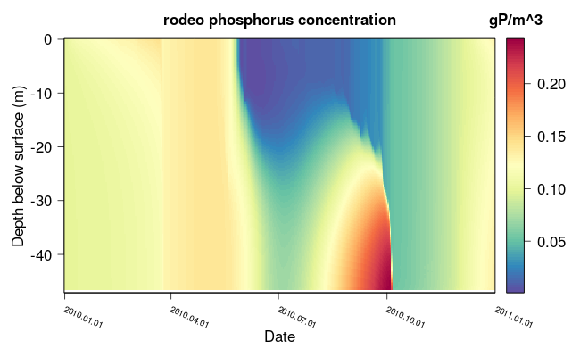
```

```{r echo=FALSE, out.width='100%'}
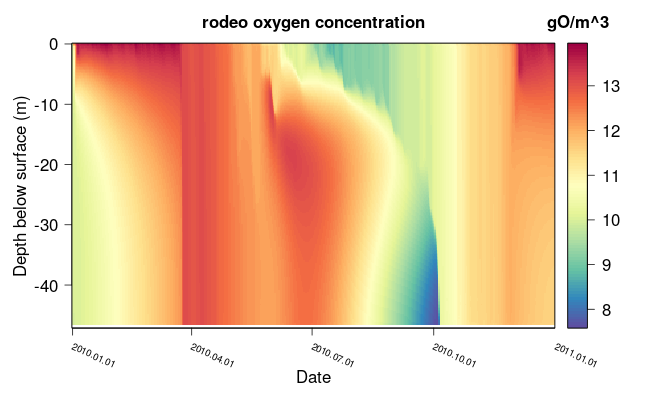
```

```{r echo=FALSE, out.width='100%'}
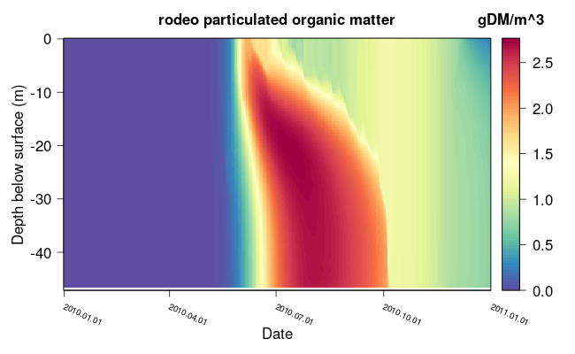
```

```{r echo=FALSE, out.width='100%'}
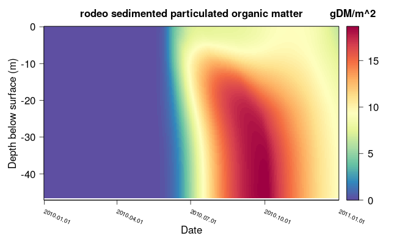
```

# Additional features

## State variable arguments

There are a few additional arguments for state variables that can be defined in *FABM*. In order to
use them a new column in the state variable data frame needs to be added with exactly the name.

- *minimum*: minnimum allowed value for the state variable (used in the numerical solver)
- *maximum*: maximum allowed value for the state variable (used in the numerical solver)
- *specific_light_extinction*: specific light extinction coefficient of this variable
- *no_precipitation_dilution*: the variable is not diluted by precipitation (logical)
- *no_river_dilution*: the variable is not diluted by river inflows (logical)

## Initial values for the state variables

By default the initial values for the *FABM* sate variables are constant throughout the whole
profile. With some tinkering we can set any profide we want as the initial values.
Therefore, we need to have (a) text file(s) with (the) profiles that you want to initialise and
install the R packages `ncdf4`, `data.table`, `gotmtools` from the AEMON-J github. The approach is
to first run *GOTM* with 0 time steps (stop date = start date). After a run with GOTM, a `restart.nc`
file is created, that can be use to restart a simulation with the same settings that ended the
previous simulation. By running with 0 time steps, this file contains the "standard" initial values,
including the ones in out biogeochemical model. Then we need to replaces the homogeneous
initial profiles in the `restart.nc` file by our specified profiles using the `ncdf4` librarie.
Lastly, we need to set the `restart` option in the `gotm.yaml` file to "true". If we run gotm now,
it will run with the initial profiles for our biogeochemical model (note that we'll have to rerun
this approach every time before we want to run GOTM, because every new GOTM run overwrites the
`restart.nc` file). Alternatively we can save
the created `restart.nc` file e.g. as `restart_init_profiles.nc` and use this file to override the
`restart.nc` before we run GOTM.

## Defining own functions

### Defining functions in the *funs* data frame

It is possible to define our own functions and call them. If the function is simple i.e. can be
calculated in one line of code (e.g. limiting functions for algae growth) it can be defined from the
*expressions* column of the *pros* data frame. In order to define own functions two additional
columns are needed in the *funs* data frame: `expression` and `arguments`. Similar to the *pros*
data frame the `expression` column gives the mathematical expression to calculate. The  `arguments`
column gives all input arguments that the functions uses, in the same order they are supplied during
function calls (e.g. in the *expression* column of the *pros* data frame), separated by commas
(",").

Using this we could e.g. implement the monod function $f_{monod} = \frac{C}{C + K}$ by changing the
*funs* data frame to:

```{r include=FALSE}
funs <- read_ods("simple_alg_O2_POM.ods", sheet = "funs")
funs <- rbind(funs, data.frame(name = "f_monod",
                               unit = "-",
                               description = "Monod funciton",
                               dependency = "",
                               tex = "f_{monod}"))
funs$dependency[4:6] <- ""
funs$expression <- NA
funs$arguments <- NA
funs[6, 6:7] <- c("C/(C + K)", "C, K")
funs_t <- funs[, -5]
funs_t$name <- paste0("$",funs_t$name, "$")
funs_t$name <- gsub("_", "\\_", funs_t$name, fixed = TRUE)
funs_t$unit[1] <- "W/m$^2$"
funs_t$dependency <- paste0("$",funs_t$dependency, "$")
funs_t$dependency <- gsub("_", "\\_", funs_t$dependency, fixed = TRUE)
funs <- read_ods("simple_alg_O2_POM.ods", sheet = "funs")
```
```{r echo=FALSE, results = "asis"}
print(xtable(funs_t, caption = paste0("Data frame `funs`: Declaration of model functions and ",
                               "dependencies from the host model.")),
      size = "\\fontsize{5.5pt}{4pt}\\selectfont", type = "latex",table.placement = "!h",
      sanitize.text.function=function(x){x})
```

Now we can use the function in the `expression` column of the *pros* data frame e.g. by replacing:

`C · mu_max · HP O4/(HP O4 + K_P ) · par/(par + K_par)` with

`C · mu_max · f_monod(HPO4, K_P · f_monod(par, K_par)`

in the `expression` column of the growth of algae.

### Defining functions in external fortran files

More complex functions can be supplied as external fortran code. Two additional columns are needed
in the *funs* data frame: `file` and `module`. They give the name of the source code file and the
name of the module, which is then loaded in the main source code. This feature is still
experimental and might lead to errors!

## Automatic model documentation

If wanted `rodeoFABM` can automatically generate LaTeX documentation of the state variables,
parameter, processes and stoichometry. To do so the function `document_model()` can be used. Lets
create a documentation of the final phytoplankton nutrients model from our [example](#final_model).
In order to work we need an additional column named *tex* (you can also use another name for this
column and supply the name to `document_model()` using the `tex` argument) in the data frames
*vars*, *pars*, *funs*, and *pros* giving the corresponding LaTeX symbols to be used. The
documentation function automatically generates LaTeX fraction, but in order for this to work all
used fractions in the *expression* column of the *pros* data frame need to be in a specified format.
The numerator and denominator need to be in brakets, even if they are just one single variable,
number, or parameter: e.g. `(O2)/(O2 + K_O2)`. In the example spread sheet file they are allready
added:

```{r}
# see column "tex"
head(vars)
# create LaTeX documentation for our model
document_model(vars, pars, pros, funs, stoi, landscape = FALSE)
```

We can see that now there are seven additional file in our worling directory:

```{r}
grep(".*\\.tex", list.files(), value = TRUE)
```

They are LaTeX tables of the models state variables (*tab_vars.tex*), used model parameters
(*tab_pars.tex*), used functions (*tab_funs.tex*), declaration of the models processes
(*tab_pros.tex*), description of the process equations (*pros_expr.tex*), the stoichiometry table
(*tab_stoi.tex*), and a simple latex document that can be used to compile all of the before
(*document_model.tex*).

The created expressions of the processes now look like this:

\tiny
```{r tidy = FALSE}
head(readLines("pros_expr.tex"))
```
\normalsize

and compiled they look like this:

```{r test-main, child = "pros_expr.tex"}
```


```{r cache=FALSE, include=FALSE}
# Reset work folder
opts_knit$set(root.dir=NULL)
# delete files
unlink(c("build","gotm_src"), recursive = TRUE)
file.remove(c("gotm", "simple_alg_O2_POM.ods", "simple_alg_O2.ods", "simple_alg_par.ods",
              "simple_alg_par_sed.ods", "tab_vars.tex", "tab_pars.tex", "tab_funs.tex", "tab_pros.tex",
              "tab_stoi.tex", "pros_expr.tex", "document_model.tex", "funs_expr.tex",
              "mat_stoi.tex", "simple_alg.ods"))
```

# References
